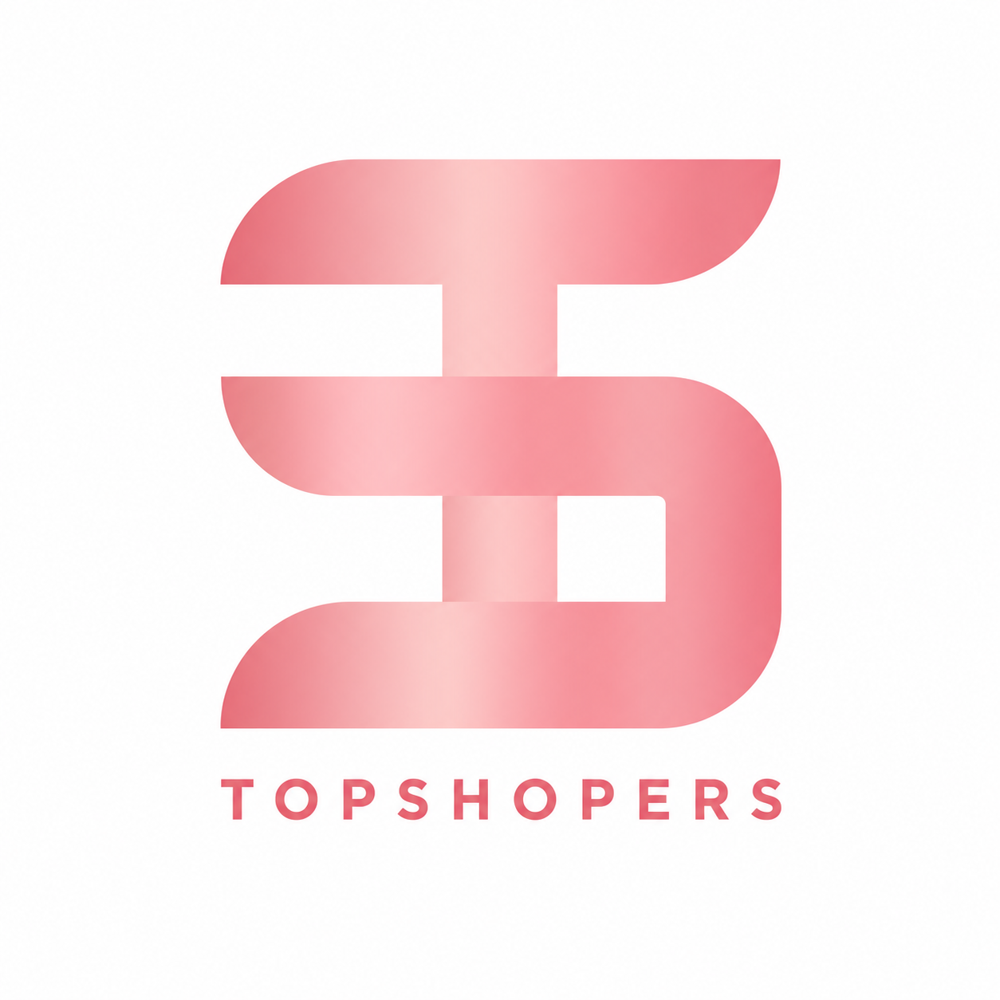
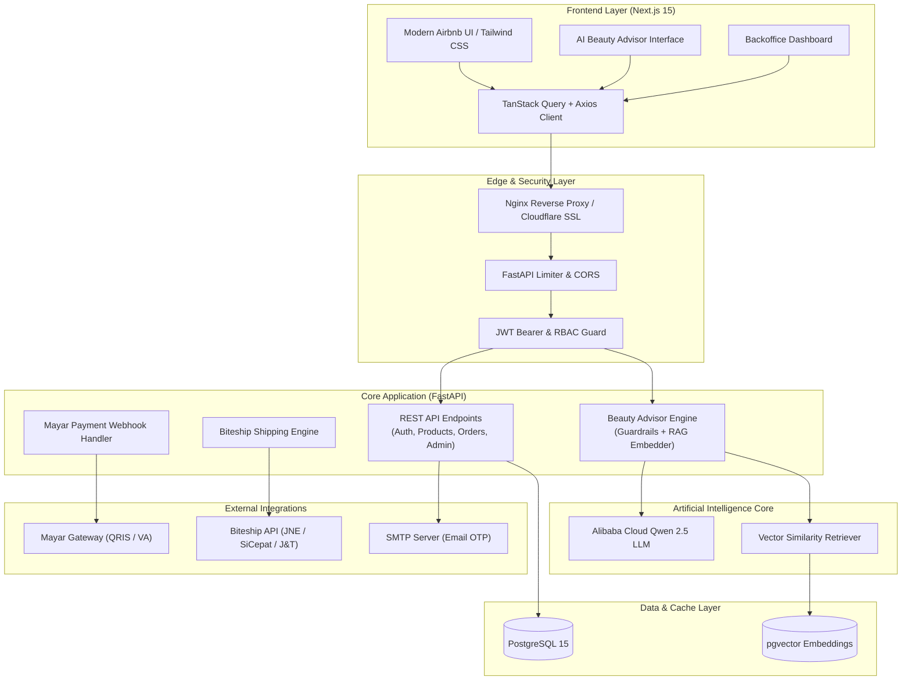

<div align="center">

  

  # 🌟 Topshop Kosmetik AI
  ### *The Next-Gen Intelligent Skincare Commerce & Hyper-Personalized AI Advisor*

  <p align="center">
    <strong>Belanja Skincare Cerdas Didukung AI RAG, Rekomendasi Dermatologis Real-time, dan Logistik Indonesia Terintegrasi.</strong>
  </p>

  <p align="center">
    <a href="#-fitur-unggulan"></a>
    <a href="#-fitur-unggulan"></a>
    <a href="#-fitur-unggulan"></a>
    <a href="#-fitur-unggulan"></a>
    <a href="#-fitur-unggulan"></a>
    <a href="#-fitur-unggulan"></a>
    <a href="#-fitur-unggulan"></a>
    <a href="#-fitur-unggulan"></a>
  </p>

  <p align="center">
    <a href="#-fitur-unggulan">✨ Fitur Utama</a> •
    <a href="#-arsitektur-sistem">📐 Arsitektur</a> •
    <a href="#-tech-stack">💻 Tech Stack</a> •
    <a href="#-memulai-quickstart">🚀 Cara Menjalankan</a> •
    <a href="docs/guide/README.md">📖 Buku Panduan</a> •
    <a href="#-tentang-pengembang">👨‍💻 Founder</a>
  </p>

</div>

---

## 💡 The Startup Vision

> **"73% konsumen skincare merasa bingung memilih produk yang tepat untuk tipe & kondisi kulit mereka, sementara katalog kosmetik umum tidak menawarkan konsultasi bahan aktif personal."**

**Topshop Beauty AI** mendisrupsi pengalaman belanja kosmetik tradisional di Indonesia dengan menggabungkan:
1. **Airbnb-Grade UI/UX**: Pengalaman visual elegan, micro-interactions halus dengan GSAP, dan *Floating Search Capsule* 3-dimensi (Nama/Brand, Tipe Kulit, Masalah Kulit).
2. **AI Beauty Advisor Berbasis RAG (Retrieval-Augmented Generation)**: Konsultan virtual 24/7 bertenaga LLM Qwen yang memahami profil biologis kulit pengguna, mencocokkan bahan aktif (*active ingredients*), dan menyematkan rekomendasi produk interaktif langsung di dalam chat.
3. **End-to-End E-Commerce Engine**: Sinkronisasi stok real-time, kalkulasi ongkir multi-ekspedisi live via Biteship (JNE, SiCepat, J&T), pembayaran instan QRIS & Virtual Account via Mayar, serta sistem review pembeli terverifikasi.

---

## ✨ Fitur Unggulan

### 🧠 1. AI Beauty Advisor & Smart Recommendation
- **Personalized Skin Consultation**: Pengguna dapat berdiskusi santai dalam bahasa Indonesia natural mengenai jerawat, hiperpigmentasi, barrier kulit, atau kulit sensitif.
- **RAG Vector Search**: Pencarian kemiripan produk memanfaatkan `pgvector` berdimensi tinggi untuk merekomendasikan formulasi kosmetik yang paling presisi.
- **Safety Guardrails & Medical Disclaimer**: Dilengkapi *Input & Output Guard* untuk menyaring pertanyaan non-skincare dan menyertakan batasan konsultasi medis.
- **In-Chat Interactive Action**: Kartu produk interaktif muncul langsung di balon percakapan, lengkap dengan harga, kecocokan kulit, dan tombol instan *“+ Keranjang”*.

### 🛍️ 2. Katalog Modern & Airbnb Search Capsule
- **Floating Search Capsule**: Navigasi pencarian dinamis 3-segmen ala Airbnb (Nama Produk/Brand, Jenis Kulit, Masalah Kulit).
- **Multi-Facet Filtering**: Filter instan berdasarkan Kategori, Brand, Rentang Harga, Tipe Kulit (Berminyak, Kering, Kombinasi, Sensitif, Normal), dan Masalah Kulit.
- **Detail Transparan**: Panel kandungan bahan aktif (*ingredients breakdown*), panduan cara pakai, dan rating kepuasan pembeli terverifikasi.

### 💳 3. Checkout 4-Langkah & Logistik Indonesia
- **Seamless Multi-Step Checkout**: Alur 4 tahap intuitif: *Buku Alamat ➔ Pilihan Kurir ➔ Voucher Diskon ➔ Konfirmasi Pembayaran*.
- **Live Biteship Rates**: Tarik ongkir resmi real-time dari berbagai kurir (JNE Reg/YES, SiCepat BEST/GOKIL, J&T EZ) berdasarkan berat dan koordinat alamat.
- **Mayar Payment Gateway**: Pembayaran aman seketika via QRIS (semua e-wallet), Virtual Account BCA, Mandiri, BNI, BRI, dan konfirmasi webhook otomatis.
- **Live Tracking Resi**: Timeline pelacakan kurir terintegrasi langsung di akun pengguna.

### 🛡️ 4. Enterprise-Grade Security & Resilience
- **Idempotency Key Protection**: Mencegah *double-charge* transaksi checkout saat koneksi tidak stabil.
- **Distributed Rate Limiting**: Perlindungan endpoint API dari brute-force dan spam scraping.
- **Silent JWT Refresh**: Akses token diperbarui secara transparan di background tanpa membuat pengguna logout tiba-tiba.
- **Strict Role-Based Access Control (RBAC)**: Proteksi penuh antara level *Customer* dan *Admin Backoffice*.

### 📊 5. Backoffice Control Tower (Admin Dashboard)
- **Ringkasan KPI Real-time**: Grafik omset harian, total order, total customer, dan tren produk terlaris.
- **Katalog & Stok**: CRUD produk lengkap dengan upload foto, tagging taksonomi kulit, dan kontrol inventori.
- **Manajemen Pesanan**: Input nomor resi pengiriman, verifikasi status pembayaran, dan pembatalan pesanan.
- **Voucher Promosi**: Buat kode promo dengan batasan kuota, minimal belanja, dan periode kedaluwarsa.

---

## 📐 Arsitektur Sistem



---

## 💻 Tech Stack

| Layer | Teknologi | Deskripsi |
|---|---|---|
| **Frontend Framework** | [Next.js 15](https://nextjs.org/) (App Router, React 19) | Server & Client Components berkecepatan tinggi |
| **Styling & Design** | [Tailwind CSS v3.4](https://tailwindcss.com/) + [shadcn/ui](https://ui.shadcn.com/) | Sistem desain minimalis Airbnb-style |
| **Animation** | [GSAP](https://greensock.com/gsap/) & [Lucide Icons](https://lucide.dev/) | Micro-interactions dan transisi scroll halus |
| **State & API Cache** | [TanStack React Query v5](https://tanstack.com/query) | Optimistic updates & auto cache invalidation |
| **Backend Framework** | [FastAPI](https://fastapi.tiangolo.com/) (Python 3.12/3.11) | Async web framework berperforma tinggi |
| **Database ORM** | [SQLAlchemy 2.0 Async](https://www.sqlalchemy.org/) + [Alembic](https://alembic.sqlalchemy.org/) | Async engine dengan migrasi skema otomatis |
| **Vector Database** | [PostgreSQL 15](https://www.postgresql.org/) + [pgvector](https://github.com/pgvector/pgvector) | Penyimpanan embedding katalog produk & RAG search |
| **LLM Provider** | [Alibaba Qwen 2.5](https://alibabacloud.com/) / OpenAI Compat | Model penalaran natural untuk konsultasi kecantikan |
| **Payment Gateway** | [Mayar.id](https://mayar.id/) | Pembayaran instan via QRIS dan Virtual Account |
| **Logistik** | [Biteship API](https://biteship.com/) | Live rate cek ongkir & tracking resi multi-kurir |
| **DevOps & Container** | [Docker](https://www.docker.com/) & [Nginx](https://nginx.org/) | Multi-stage build & production-ready reverse proxy |

---

## 📁 Struktur Direktori

```text
22_Topshop_Ecommerce/
├── backend/                  # 🐍 Backend FastAPI & AI Engine
│   ├── alembic/              # Database schema migrations
│   ├── app/
│   │   ├── addresses/        # Manajemen alamat pengiriman
│   │   ├── admin/            # Endpoint admin & analytics
│   │   ├── auth/             # JWT, OTP email, Google OAuth
│   │   ├── beauty_advisor/   # AI Chat, RAG, Qwen LLM, & Guardrails
│   │   ├── cart/             # Keranjang belanja & wishlist
│   │   ├── orders/           # Pemrosesan order & checkout
│   │   ├── payments/         # Integrasi Mayar & webhook
│   │   ├── products/         # Katalog produk & metadata kulit
│   │   ├── shipping/         # Integrasi kurir Biteship
│   │   └── core/             # Database, Security, Config, Limiter
│   ├── tests/                # Test suites komprehensif (Phase 1-7)
│   ├── Dockerfile
│   └── requirements.txt
│
├── frontend/                 # ⚡ Frontend Next.js 15
│   ├── app/                  # App router: (auth), (shop), (account), admin, beauty-advisor
│   ├── components/           # UI components, layout, landing, product, chat
│   ├── features/             # Business logic hooks & API integration
│   ├── lib/                  # Axios interceptors, utils, query client
│   └── public/               # Asset gambar, icon, logo kurir
│
├── deploy/                   # 🚀 Skrip Nginx, SSL, dan backup produksi
├── docker/                   # Inisialisasi database Postgres & pgvector
├── docs/                     # 📚 Dokumentasi lengkap, API contracts, & User Guide
└── scripts/                  # 🛠️ Utility scripts (start, stop, seed, deploy)
```

---

## 🚀 Memulai (Quickstart)

### Opsi A: Menggunakan Docker Compose (Paling Cepat)

1. **Clone repositori:**
   ```bash
   git clone https://github.com/ChrisnaFajarArditha-22312111/topshopbeauty.git
   cd topshopbeauty
   ```

2. **Siapkan Environment Variables:**
   ```bash
   cp .env.example .env
   ```
   *Sesuaikan konfigurasi kredensial (Database, JWT Secret, Biteship API Key, Mayar Token, Qwen Key).*

3. **Jalankan semua service:**
   ```bash
   docker compose up -d --build
   ```

4. **Seed database dengan katalog awal:**
   ```bash
   bash scripts/seed.sh
   ```

5. **Buka di Browser:**
   - **Storefront & AI Chat**: [http://localhost:3000](http://localhost:3000)
   - **Interactive API Docs (Swagger)**: [http://localhost:8000/docs](http://localhost:8000/docs)
   - **Alternative API Docs (ReDoc)**: [http://localhost:8000/redoc](http://localhost:8000/redoc)

---

### Opsi B: Development Lokal (Tanpa Docker)

#### 1. Backend Setup:
```bash
cd backend
python -m venv venv
source venv/bin/activate  # Untuk Windows: venv\Scripts\activate
pip install -r requirements.txt

# Jalankan server API
uvicorn app.main:app --reload --port 8000
```

#### 2. Frontend Setup:
```bash
cd frontend
npm install
npm run dev
```
Aplikasi frontend akan berjalan di `http://localhost:3000`.

---

## 🧪 Pengujian & Kualitas Kode

Backend dilengkapi dengan rangkaian automated test suite menyeluruh yang menguji integritas alur dari Phase 1 hingga Phase 7:

```bash
cd backend
source venv/bin/activate
pytest tests/tests_all_endpoints.py -v
```

Untuk melihat panduan skenario uji coba lengkap dari kacamata pengguna, silakan baca [**Buku Panduan Pengujian (Bab 7)**](docs/guide/07-skenario-uji-coba-end-to-end.md).

---

## 👨‍💻 Tentang Pengembang

Proyek ini dirancang dan dikembangkan dengan dedikasi tinggi oleh:

- **Nama**: Chrisna Fajar Arditha
- **NPM**: 22312111
- **Program Studi**: S1 Informatika
- **Institusi**: [Universitas Teknokrat Indonesia](https://teknokrat.ac.id/)
- **Email**: [chrisna_fajar_arditha@teknokrat.ac.id](mailto:chrisna_fajar_arditha@teknokrat.ac.id)
- **GitHub**: [@ChrisnaFajarArditha-22312111](https://github.com/ChrisnaFajarArditha-22312111)

---

## 📄 Lisensi

Didistribusikan di bawah Lisensi **MIT**. Lihat file [`LICENSE`](LICENSE) untuk informasi lebih lanjut.

<div align="center">
  <sub>Dibuat dengan ❤️ untuk merevolusi industri kecantikan & e-commerce kosmetik Indonesia.</sub>
</div>
